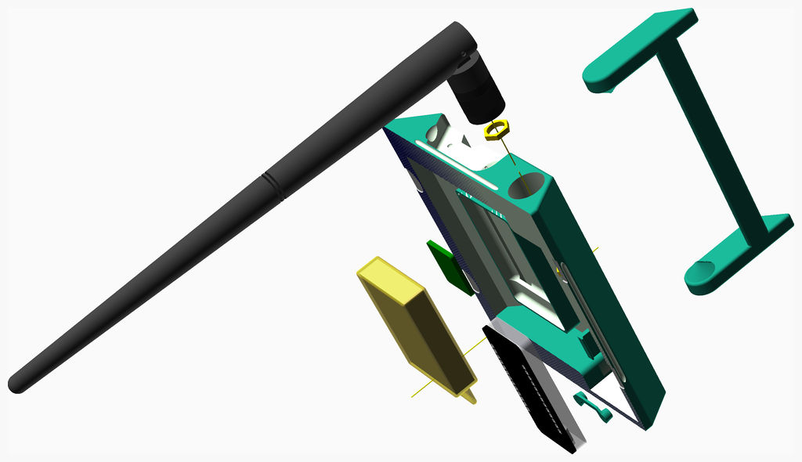
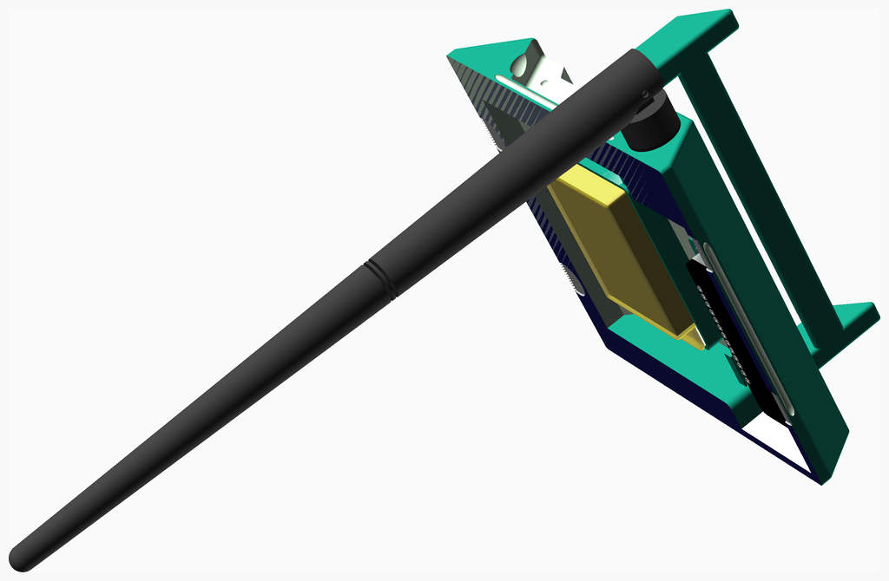
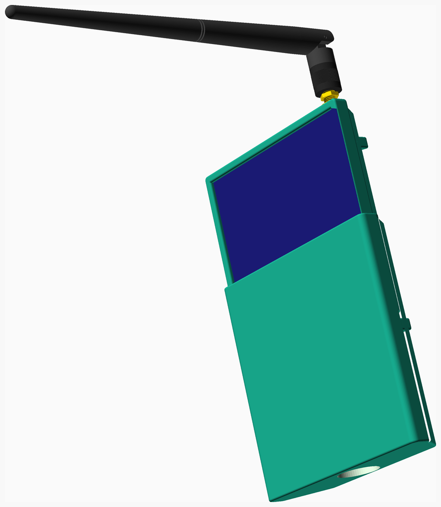

# LoRaMeshNodes
These are the assembly instructions for the Mobile Solar Node (Variant A) (MSNvA),
a portable solar powered [Meshtastic](https://meshtastic.org) or
[MeshCore](https://meshcore.co.uk) node.

---
## Table of Contents
1. [Parts list](#Parts_list)
1. [MSNvA LEnc Assembly](#MSNvA_lEnc_assembly)
1. [MSNvA Assembly](#MSNvA_assembly)

[Top](#TOP)

---

## Parts list
| MSNvA&nbsp;LEnc | MSNvA | TOTALS |  |
|---:|---:|---:|:---|
|  |  | | **Vitamins** |
| &nbsp;&nbsp;.&nbsp; | &nbsp;&nbsp;1&nbsp; |  &nbsp;&nbsp;1&nbsp; | &nbsp;&nbsp; Antenna 20cm LoRa Antenna |
| &nbsp;&nbsp;.&nbsp; | &nbsp;&nbsp;1&nbsp; |  &nbsp;&nbsp;1&nbsp; | &nbsp;&nbsp; Heltec T144 |
| &nbsp;&nbsp;.&nbsp; | &nbsp;&nbsp;1&nbsp; |  &nbsp;&nbsp;1&nbsp; | &nbsp;&nbsp; Lithium-Polymer-Akku 3,7V 3000mAh |
| &nbsp;&nbsp;2&nbsp; | &nbsp;&nbsp;.&nbsp; |  &nbsp;&nbsp;2&nbsp; | &nbsp;&nbsp; Nut M3 x 2.4mm  |
| &nbsp;&nbsp;.&nbsp; | &nbsp;&nbsp;1&nbsp; |  &nbsp;&nbsp;1&nbsp; | &nbsp;&nbsp; Nut M6.25 x 1.8mm  |
| &nbsp;&nbsp;.&nbsp; | &nbsp;&nbsp;2&nbsp; |  &nbsp;&nbsp;2&nbsp; | &nbsp;&nbsp; Screw M3 cap x 10mm |
| &nbsp;&nbsp;.&nbsp; | &nbsp;&nbsp;1&nbsp; |  &nbsp;&nbsp;1&nbsp; | &nbsp;&nbsp; Washer star M6.4 x 0.6mm |
| &nbsp;&nbsp;2&nbsp; | &nbsp;&nbsp;7&nbsp; | &nbsp;&nbsp;9&nbsp; | &nbsp;&nbsp;Total vitamins count |
|  |  | | **3D printed parts** |
| &nbsp;&nbsp;.&nbsp; | &nbsp;&nbsp;1&nbsp; |  &nbsp;&nbsp;1&nbsp; | &nbsp;&nbsp;MNvA_buttons.stl |
| &nbsp;&nbsp;1&nbsp; | &nbsp;&nbsp;.&nbsp; |  &nbsp;&nbsp;1&nbsp; | &nbsp;&nbsp;MNvA_lEnc.stl |
| &nbsp;&nbsp;.&nbsp; | &nbsp;&nbsp;1&nbsp; |  &nbsp;&nbsp;1&nbsp; | &nbsp;&nbsp;MNvA_uEnc.stl |
| &nbsp;&nbsp;1&nbsp; | &nbsp;&nbsp;2&nbsp; | &nbsp;&nbsp;3&nbsp; | &nbsp;&nbsp;Total 3D printed parts count |

[Top](#TOP)

---

## MSNvA LEnc Assembly
### Vitamins
|Qty|Description|
|---:|:----------|
|2| Nut M3 x 2.4mm |

### 3D Printed parts

| 1 x [MNvA_lEnc.stl](stls/MNvA_lEnc.stl) |
|---|
|  

### Assembly instructions

1. Attach the antenna to the enclosure 
2. Connect it to the Heltec T114 board
3. Insert buttons
4. Insert Heltec T114 board
5. Connect and insert the GNSS module (optional)
6. Attach the battery with two zip ties
7. Connect the battery to the Heltec T114 board

[Top](#TOP)

---

## MSNvA Assembly
### Vitamins
|Qty|Description|
|---:|:----------|
|1| Antenna 20cm LoRa Antenna|
|1| Heltec T144|
|1| Lithium-Polymer-Akku 3,7V 3000mAh|
|1| Nut M6.25 x 1.8mm |
|2| Screw M3 cap x 10mm|
|1| Washer star M6.4 x 0.6mm|

### 3D Printed parts

| 1 x [MNvA_buttons.stl](stls/MNvA_buttons.stl) | 1 x [MNvA_uEnc.stl](stls/MNvA_uEnc.stl) |
|---|---|
|  |  

### Sub-assemblies

| 1 x MSNvA_lEnc_assembly |
|---|
|  

### Assembly instructions

Slide on the protective cover for transportation.

[Top](#TOP)

---
Insert components, attach top and fasten screws.

[Top](#TOP)
