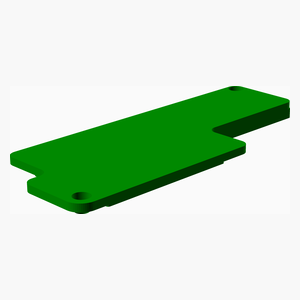

# LoRaMeshNodes
These are the assembly instructions for the Mobile Node (Variant A) (MNvA),
a portable [Meshtastic](https://meshtastic.org) or
[MeshCore](https://meshcore.co.uk) node.

---
## Table of Contents
1. [Parts list](#Parts_list)
1. [MNvA LEnc Assembly](#MNvA_lEnc_assembly)
1. [MNvA Assembly](#MNvA_assembly)

[Top](#TOP)

---

## Parts list
| MNvA&nbsp;LEnc | MNvA | TOTALS |  |
|---:|---:|---:|:---|
|  |  | | **Vitamins** |
| &nbsp;&nbsp;.&nbsp; | &nbsp;&nbsp;1&nbsp; |  &nbsp;&nbsp;1&nbsp; | &nbsp;&nbsp; Antenna 20cm LoRa Antenna |
| &nbsp;&nbsp;.&nbsp; | &nbsp;&nbsp;1&nbsp; |  &nbsp;&nbsp;1&nbsp; | &nbsp;&nbsp; Lithium-Polymer-Akku 3,7V 3000mAh |
| &nbsp;&nbsp;2&nbsp; | &nbsp;&nbsp;.&nbsp; |  &nbsp;&nbsp;2&nbsp; | &nbsp;&nbsp; Nut M3 x 2.4mm  |
| &nbsp;&nbsp;.&nbsp; | &nbsp;&nbsp;1&nbsp; |  &nbsp;&nbsp;1&nbsp; | &nbsp;&nbsp; Nut M6.25 x 1.8mm  |
| &nbsp;&nbsp;.&nbsp; | &nbsp;&nbsp;2&nbsp; |  &nbsp;&nbsp;2&nbsp; | &nbsp;&nbsp; Screw M3 dome x 10mm |
| &nbsp;&nbsp;.&nbsp; | &nbsp;&nbsp;1&nbsp; |  &nbsp;&nbsp;1&nbsp; | &nbsp;&nbsp; Washer star M6.4 x 0.6mm |
| &nbsp;&nbsp;2&nbsp; | &nbsp;&nbsp;6&nbsp; | &nbsp;&nbsp;8&nbsp; | &nbsp;&nbsp;Total vitamins count |
|  |  | | **3D printed parts** |
| &nbsp;&nbsp;.&nbsp; | &nbsp;&nbsp;1&nbsp; |  &nbsp;&nbsp;1&nbsp; | &nbsp;&nbsp;MNvA_buttons.stl |
| &nbsp;&nbsp;1&nbsp; | &nbsp;&nbsp;.&nbsp; |  &nbsp;&nbsp;1&nbsp; | &nbsp;&nbsp;MNvA_lEnc.stl |
| &nbsp;&nbsp;.&nbsp; | &nbsp;&nbsp;1&nbsp; |  &nbsp;&nbsp;1&nbsp; | &nbsp;&nbsp;MNvA_uEnc.stl |
| &nbsp;&nbsp;1&nbsp; | &nbsp;&nbsp;2&nbsp; | &nbsp;&nbsp;3&nbsp; | &nbsp;&nbsp;Total 3D printed parts count |

[Top](#TOP)

---

## MNvA LEnc Assembly
### Vitamins
|Qty|Description|
|---:|:----------|
|2| Nut M3 x 2.4mm |

### 3D Printed parts

| 1 x [MNvA_lEnc.stl](stls/MNvA_lEnc.stl) |
|---|
|  

### Assembly instructions

Insert nuts during print

[Top](#TOP)

---

## MNvA Assembly
### Vitamins
|Qty|Description|
|---:|:----------|
|1| Antenna 20cm LoRa Antenna|
|1| Lithium-Polymer-Akku 3,7V 3000mAh|
|1| Nut M6.25 x 1.8mm |
|2| Screw M3 dome x 10mm|
|1| Washer star M6.4 x 0.6mm|

### 3D Printed parts

| 1 x [MNvA_buttons.stl](stls/MNvA_buttons.stl) | 1 x [MNvA_uEnc.stl](stls/MNvA_uEnc.stl) |
|---|---|
|  |  

### Sub-assemblies

| 1 x MNvA_lEnc_assembly |
|---|
|  

### Assembly instructions

Insert components, attach top and fasten screws.

[Top](#TOP)
