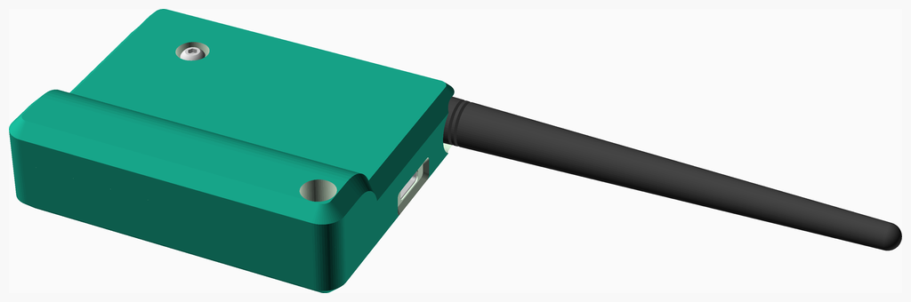
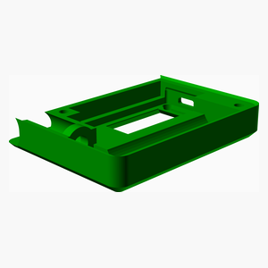
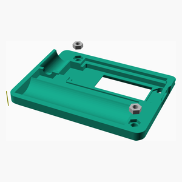
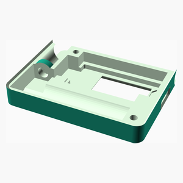
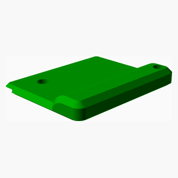
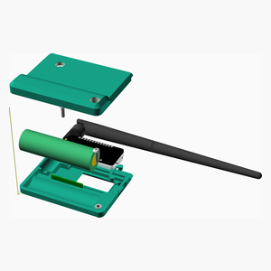
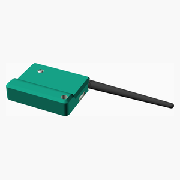

# LoRaMeshNodes
These are the assembly instructions for the Mobile Node (Variant A) (MNvA),
a portable [Meshtastic](https://meshtastic.org) or
[MeshCore](https://meshcore.co.uk) node.

---
## Table of Contents
1. [Parts list](#Parts_list)
1. [MNvB LEnc Assembly](#MNvB_lEnc_assembly)
1. [MNvB Assembly](#MNvB_assembly)

[Top](#TOP)

---

## Parts list
| MNvB&nbsp;LEnc | MNvB | TOTALS |  |
|---:|---:|---:|:---|
|  |  | | **Vitamins** |
| &nbsp;&nbsp;.&nbsp; | &nbsp;&nbsp;1&nbsp; |  &nbsp;&nbsp;1&nbsp; | &nbsp;&nbsp; 1S 3.7V battery protection board |
| &nbsp;&nbsp;.&nbsp; | &nbsp;&nbsp;1&nbsp; |  &nbsp;&nbsp;1&nbsp; | &nbsp;&nbsp; Antenna 20cm LoRa Antenna |
| &nbsp;&nbsp;.&nbsp; | &nbsp;&nbsp;1&nbsp; |  &nbsp;&nbsp;1&nbsp; | &nbsp;&nbsp; Cell Samsung 25R 18650 LION |
| &nbsp;&nbsp;.&nbsp; | &nbsp;&nbsp;1&nbsp; |  &nbsp;&nbsp;1&nbsp; | &nbsp;&nbsp; Heltec T144 |
| &nbsp;&nbsp;2&nbsp; | &nbsp;&nbsp;.&nbsp; |  &nbsp;&nbsp;2&nbsp; | &nbsp;&nbsp; Nut M3 x 2.4mm  |
| &nbsp;&nbsp;.&nbsp; | &nbsp;&nbsp;1&nbsp; |  &nbsp;&nbsp;1&nbsp; | &nbsp;&nbsp; Nut M6.25 x 1.8mm  |
| &nbsp;&nbsp;.&nbsp; | &nbsp;&nbsp;2&nbsp; |  &nbsp;&nbsp;2&nbsp; | &nbsp;&nbsp; Screw M3 dome x 10mm |
| &nbsp;&nbsp;.&nbsp; | &nbsp;&nbsp;1&nbsp; |  &nbsp;&nbsp;1&nbsp; | &nbsp;&nbsp; Washer star M6.4 x 0.6mm |
| &nbsp;&nbsp;2&nbsp; | &nbsp;&nbsp;8&nbsp; | &nbsp;&nbsp;10&nbsp; | &nbsp;&nbsp;Total vitamins count |
|  |  | | **3D printed parts** |
| &nbsp;&nbsp;.&nbsp; | &nbsp;&nbsp;1&nbsp; |  &nbsp;&nbsp;1&nbsp; | &nbsp;&nbsp;MNvB_buttons.stl |
| &nbsp;&nbsp;1&nbsp; | &nbsp;&nbsp;.&nbsp; |  &nbsp;&nbsp;1&nbsp; | &nbsp;&nbsp;MNvB_lEnc.stl |
| &nbsp;&nbsp;.&nbsp; | &nbsp;&nbsp;1&nbsp; |  &nbsp;&nbsp;1&nbsp; | &nbsp;&nbsp;MNvB_uEnc.stl |
| &nbsp;&nbsp;1&nbsp; | &nbsp;&nbsp;2&nbsp; | &nbsp;&nbsp;3&nbsp; | &nbsp;&nbsp;Total 3D printed parts count |

[Top](#TOP)

---

## MNvB LEnc Assembly
### Vitamins
|Qty|Description|
|---:|:----------|
|2| Nut M3 x 2.4mm |

### 3D Printed parts

| 1 x [MNvB_lEnc.stl](stls/MNvB_lEnc.stl) |
|---|
|  

### Assembly instructions

Insert nuts during print

[Top](#TOP)

---

## MNvB Assembly
### Vitamins
|Qty|Description|
|---:|:----------|
|1| 1S 3.7V battery protection board|
|1| Antenna 20cm LoRa Antenna|
|1| Cell Samsung 25R 18650 LION|
|1| Heltec T144|
|1| Nut M6.25 x 1.8mm |
|2| Screw M3 dome x 10mm|
|1| Washer star M6.4 x 0.6mm|

### 3D Printed parts

| 1 x [MNvB_buttons.stl](stls/MNvB_buttons.stl) | 1 x [MNvB_uEnc.stl](stls/MNvB_uEnc.stl) |
|---|---|
|  |  

### Sub-assemblies

| 1 x MNvB_lEnc_assembly |
|---|
|  

### Assembly instructions

Insert components, attach top and fasten screws.

[Top](#TOP)
