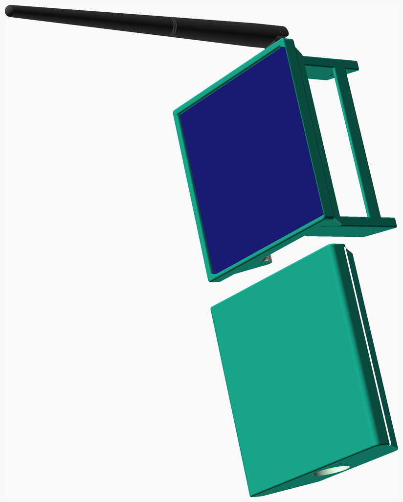

# LoRaMeshNodes
These are the assembly instructions for the Mobile Solar Node (Variant A) (MSNvB),
a portable solar powered [Meshtastic](https://meshtastic.org) or
[MeshCore](https://meshcore.co.uk) node.

---
## Table of Contents
1. [Parts list](#Parts_list)
1. [MSNvB LEnc Assembly](#MSNvB_lEnc_assembly)
1. [MSNvB Enc Assembly](#MSNvB_enc_assembly)
1. [MSNvB Assembly](#MSNvB_assembly)

[Top](#TOP)

---

## Parts list
| MSNvB&nbsp;LEnc | MSNvB&nbsp;Enc | MSNvB | TOTALS |  |
|---:|---:|---:|---:|:---|
|  |  |  | | **Vitamins** |
| &nbsp;&nbsp;1&nbsp; | &nbsp;&nbsp;.&nbsp; | &nbsp;&nbsp;.&nbsp; |  &nbsp;&nbsp;1&nbsp; | &nbsp;&nbsp; 1S 3.7V battery protection board |
| &nbsp;&nbsp;1&nbsp; | &nbsp;&nbsp;.&nbsp; | &nbsp;&nbsp;.&nbsp; |  &nbsp;&nbsp;1&nbsp; | &nbsp;&nbsp; Antenna 20cm LoRa Antenna |
| &nbsp;&nbsp;1&nbsp; | &nbsp;&nbsp;.&nbsp; | &nbsp;&nbsp;.&nbsp; |  &nbsp;&nbsp;1&nbsp; | &nbsp;&nbsp; Battery negative contact |
| &nbsp;&nbsp;1&nbsp; | &nbsp;&nbsp;.&nbsp; | &nbsp;&nbsp;.&nbsp; |  &nbsp;&nbsp;1&nbsp; | &nbsp;&nbsp; Battery positive contact |
| &nbsp;&nbsp;1&nbsp; | &nbsp;&nbsp;.&nbsp; | &nbsp;&nbsp;.&nbsp; |  &nbsp;&nbsp;1&nbsp; | &nbsp;&nbsp; Cell Samsung 25R 18650 LION |
| &nbsp;&nbsp;1&nbsp; | &nbsp;&nbsp;.&nbsp; | &nbsp;&nbsp;.&nbsp; |  &nbsp;&nbsp;1&nbsp; | &nbsp;&nbsp; Heltec L76K_GNSS Module |
| &nbsp;&nbsp;1&nbsp; | &nbsp;&nbsp;.&nbsp; | &nbsp;&nbsp;.&nbsp; |  &nbsp;&nbsp;1&nbsp; | &nbsp;&nbsp; Heltec T144 |
| &nbsp;&nbsp;1&nbsp; | &nbsp;&nbsp;.&nbsp; | &nbsp;&nbsp;.&nbsp; |  &nbsp;&nbsp;1&nbsp; | &nbsp;&nbsp; Nut M6.25 x 1.8mm  |
| &nbsp;&nbsp;1&nbsp; | &nbsp;&nbsp;1&nbsp; | &nbsp;&nbsp;.&nbsp; |  &nbsp;&nbsp;2&nbsp; | &nbsp;&nbsp; Solar Panel 100x100mm² 5V 3W |
| &nbsp;&nbsp;1&nbsp; | &nbsp;&nbsp;.&nbsp; | &nbsp;&nbsp;.&nbsp; |  &nbsp;&nbsp;1&nbsp; | &nbsp;&nbsp; Washer star M6.4 x 0.6mm |
| &nbsp;&nbsp;10&nbsp; | &nbsp;&nbsp;1&nbsp; | &nbsp;&nbsp;.&nbsp; | &nbsp;&nbsp;11&nbsp; | &nbsp;&nbsp;Total vitamins count |
|  |  |  | | **3D printed parts** |
| &nbsp;&nbsp;1&nbsp; | &nbsp;&nbsp;.&nbsp; | &nbsp;&nbsp;.&nbsp; |  &nbsp;&nbsp;1&nbsp; | &nbsp;&nbsp;MSNvB_buttons.stl |
| &nbsp;&nbsp;.&nbsp; | &nbsp;&nbsp;.&nbsp; | &nbsp;&nbsp;1&nbsp; |  &nbsp;&nbsp;1&nbsp; | &nbsp;&nbsp;MSNvB_cov.stl |
| &nbsp;&nbsp;1&nbsp; | &nbsp;&nbsp;.&nbsp; | &nbsp;&nbsp;.&nbsp; |  &nbsp;&nbsp;1&nbsp; | &nbsp;&nbsp;MSNvB_lEnc.stl |
| &nbsp;&nbsp;1&nbsp; | &nbsp;&nbsp;.&nbsp; | &nbsp;&nbsp;.&nbsp; |  &nbsp;&nbsp;1&nbsp; | &nbsp;&nbsp;MSNvB_stand.stl |
| &nbsp;&nbsp;.&nbsp; | &nbsp;&nbsp;1&nbsp; | &nbsp;&nbsp;.&nbsp; |  &nbsp;&nbsp;1&nbsp; | &nbsp;&nbsp;MSNvB_top.stl |
| &nbsp;&nbsp;3&nbsp; | &nbsp;&nbsp;1&nbsp; | &nbsp;&nbsp;1&nbsp; | &nbsp;&nbsp;5&nbsp; | &nbsp;&nbsp;Total 3D printed parts count |

[Top](#TOP)

---

## MSNvB LEnc Assembly
### Vitamins
|Qty|Description|
|---:|:----------|
|1| 1S 3.7V battery protection board|
|1| Antenna 20cm LoRa Antenna|
|1| Battery negative contact|
|1| Battery positive contact|
|1| Cell Samsung 25R 18650 LION|
|1| Heltec L76K_GNSS Module|
|1| Heltec T144|
|1| Nut M6.25 x 1.8mm |
|1| Solar Panel 100x100mm² 5V 3W|
|1| Washer star M6.4 x 0.6mm|

### 3D Printed parts

| 1 x [MSNvB_buttons.stl](stls/MSNvB_buttons.stl) | 1 x [MSNvB_lEnc.stl](stls/MSNvB_lEnc.stl) | 1 x [MSNvB_stand.stl](stls/MSNvB_stand.stl) |
|---|---|---|
|  |  |  

### Assembly instructions

1. Clamp the stand on to the enclosure 
1. Attach the antenna to the enclosure 
2. Connect it to the Heltec T114 board
3. Insert buttons
4. Insert Heltec T114 board
5. Connect and insert the GNSS module (optional)
6. Attach the battery with two zip ties
7. Connect the battery to the Heltec T114 board

[Top](#TOP)

---

## MSNvB Enc Assembly
### Vitamins
|Qty|Description|
|---:|:----------|
|1| Solar Panel 100x100mm² 5V 3W|

### 3D Printed parts

| 1 x [MSNvB_top.stl](stls/MSNvB_top.stl) |
|---|
|  

### Sub-assemblies

| 1 x MSNvB_lEnc_assembly |
|---|
|  

### Assembly instructions

1. Connect the solar panel to the Heltec T114 board
2. Place the solar panel on the enclosure
3. Attach the top frame

[Top](#TOP)

---

## MSNvB Assembly
### 3D Printed parts

| 1 x [MSNvB_cov.stl](stls/MSNvB_cov.stl) |
|---|
|  

### Sub-assemblies

| 1 x MSNvB_enc_assembly |
|---|
|  

### Assembly instructions

Slide on the protective cover for transportation.

[Top](#TOP)
