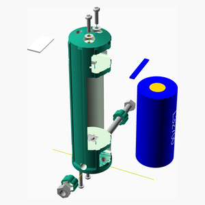

# LoRaMeshNodes

---
## Table of Contents
1. [Parts list](#Parts_list)
1. [SSNvA Solar Mount Assembly](#SSNvA_solar_mount_assembly)
1. [SSNvA Battery Cable Clamp Assembly](#SSNvA_battery_cable_clamp_assembly)
1. [SSNvA Battery Frame Assembly](#SSNvA_battery_frame_assembly)
1. [SSNvA Battery Assembly](#SSNvA_battery_assembly)
1. [SSNvA Radio Frame Assembly](#SSNvA_radio_frame_assembly)
1. [SSNvA Radio Assembly](#SSNvA_radio_assembly)
1. [SSNvA Antenna Frame Assembly](#SSNvA_antenna_frame_assembly)
1. [SSNvA Antenna Assembly](#SSNvA_antenna_assembly)
1. [SSNvA Top Assembly](#SSNvA_top_assembly)
1. [SSNvA Pole Assembly](#SSNvA_pole_assembly)
1. [SSNvA Assembly](#SSNvA_assembly)

[Top](#TOP)

---

## Parts list
| SSNvA&nbsp;Solar&nbsp;Mount | 2 x SSNvA&nbsp;Battery&nbsp;Cable&nbsp;Clamp | SSNvA&nbsp;Battery&nbsp;Frame | SSNvA&nbsp;Battery | SSNvA&nbsp;Radio&nbsp;Frame | SSNvA&nbsp;Radio | SSNvA&nbsp;Antenna&nbsp;Frame | SSNvA&nbsp;Antenna | SSNvA&nbsp;Top | SSNvA&nbsp;Pole | SSNvA | TOTALS |  |
|---:|---:|---:|---:|---:|---:|---:|---:|---:|---:|---:|---:|:---|
|  |  |  |  |  |  |  |  |  |  |  | | **Vitamins** |
| &nbsp;&nbsp;.&nbsp; | &nbsp;&nbsp;.&nbsp; | &nbsp;&nbsp;.&nbsp; | &nbsp;&nbsp;1&nbsp; | &nbsp;&nbsp;.&nbsp; | &nbsp;&nbsp;.&nbsp; | &nbsp;&nbsp;.&nbsp; | &nbsp;&nbsp;.&nbsp; | &nbsp;&nbsp;.&nbsp; | &nbsp;&nbsp;.&nbsp; | &nbsp;&nbsp;.&nbsp; |  &nbsp;&nbsp;1&nbsp; | &nbsp;&nbsp; 1S 3.2V battery protection board |
| &nbsp;&nbsp;.&nbsp; | &nbsp;&nbsp;.&nbsp; | &nbsp;&nbsp;.&nbsp; | &nbsp;&nbsp;.&nbsp; | &nbsp;&nbsp;.&nbsp; | &nbsp;&nbsp;.&nbsp; | &nbsp;&nbsp;.&nbsp; | &nbsp;&nbsp;1&nbsp; | &nbsp;&nbsp;.&nbsp; | &nbsp;&nbsp;.&nbsp; | &nbsp;&nbsp;.&nbsp; |  &nbsp;&nbsp;1&nbsp; | &nbsp;&nbsp; Antenna with N-connector |
| &nbsp;&nbsp;.&nbsp; | &nbsp;&nbsp;.&nbsp; | &nbsp;&nbsp;.&nbsp; | &nbsp;&nbsp;1&nbsp; | &nbsp;&nbsp;.&nbsp; | &nbsp;&nbsp;.&nbsp; | &nbsp;&nbsp;.&nbsp; | &nbsp;&nbsp;.&nbsp; | &nbsp;&nbsp;.&nbsp; | &nbsp;&nbsp;.&nbsp; | &nbsp;&nbsp;.&nbsp; |  &nbsp;&nbsp;1&nbsp; | &nbsp;&nbsp; Battery negative contact |
| &nbsp;&nbsp;.&nbsp; | &nbsp;&nbsp;.&nbsp; | &nbsp;&nbsp;.&nbsp; | &nbsp;&nbsp;1&nbsp; | &nbsp;&nbsp;.&nbsp; | &nbsp;&nbsp;.&nbsp; | &nbsp;&nbsp;.&nbsp; | &nbsp;&nbsp;.&nbsp; | &nbsp;&nbsp;.&nbsp; | &nbsp;&nbsp;.&nbsp; | &nbsp;&nbsp;.&nbsp; |  &nbsp;&nbsp;1&nbsp; | &nbsp;&nbsp; Battery positive contact |
| &nbsp;&nbsp;.&nbsp; | &nbsp;&nbsp;.&nbsp; | &nbsp;&nbsp;.&nbsp; | &nbsp;&nbsp;.&nbsp; | &nbsp;&nbsp;.&nbsp; | &nbsp;&nbsp;.&nbsp; | &nbsp;&nbsp;.&nbsp; | &nbsp;&nbsp;.&nbsp; | &nbsp;&nbsp;.&nbsp; | &nbsp;&nbsp;1&nbsp; | &nbsp;&nbsp;.&nbsp; |  &nbsp;&nbsp;1&nbsp; | &nbsp;&nbsp; Conduit diameter 40mmlength 2000mm |
| &nbsp;&nbsp;.&nbsp; | &nbsp;&nbsp;.&nbsp; | &nbsp;&nbsp;.&nbsp; | &nbsp;&nbsp;.&nbsp; | &nbsp;&nbsp;.&nbsp; | &nbsp;&nbsp;1&nbsp; | &nbsp;&nbsp;.&nbsp; | &nbsp;&nbsp;.&nbsp; | &nbsp;&nbsp;.&nbsp; | &nbsp;&nbsp;.&nbsp; | &nbsp;&nbsp;.&nbsp; |  &nbsp;&nbsp;1&nbsp; | &nbsp;&nbsp; Heltec T144 |
| &nbsp;&nbsp;.&nbsp; | &nbsp;&nbsp;.&nbsp; | &nbsp;&nbsp;.&nbsp; | &nbsp;&nbsp;1&nbsp; | &nbsp;&nbsp;.&nbsp; | &nbsp;&nbsp;.&nbsp; | &nbsp;&nbsp;.&nbsp; | &nbsp;&nbsp;.&nbsp; | &nbsp;&nbsp;.&nbsp; | &nbsp;&nbsp;.&nbsp; | &nbsp;&nbsp;.&nbsp; |  &nbsp;&nbsp;1&nbsp; | &nbsp;&nbsp; Li-Ion/LiFePo4 32700 3.2v |
| &nbsp;&nbsp;.&nbsp; | &nbsp;&nbsp;.&nbsp; | &nbsp;&nbsp;.&nbsp; | &nbsp;&nbsp;1&nbsp; | &nbsp;&nbsp;.&nbsp; | &nbsp;&nbsp;.&nbsp; | &nbsp;&nbsp;.&nbsp; | &nbsp;&nbsp;.&nbsp; | &nbsp;&nbsp;.&nbsp; | &nbsp;&nbsp;.&nbsp; | &nbsp;&nbsp;.&nbsp; |  &nbsp;&nbsp;1&nbsp; | &nbsp;&nbsp; MPPT Solar Charge Controller |
| &nbsp;&nbsp;.&nbsp; | &nbsp;&nbsp;4&nbsp; | &nbsp;&nbsp;.&nbsp; | &nbsp;&nbsp;.&nbsp; | &nbsp;&nbsp;.&nbsp; | &nbsp;&nbsp;2&nbsp; | &nbsp;&nbsp;.&nbsp; | &nbsp;&nbsp;.&nbsp; | &nbsp;&nbsp;.&nbsp; | &nbsp;&nbsp;.&nbsp; | &nbsp;&nbsp;.&nbsp; |  &nbsp;&nbsp;6&nbsp; | &nbsp;&nbsp; Nut M3 x 2.4mm  |
| &nbsp;&nbsp;3&nbsp; | &nbsp;&nbsp;.&nbsp; | &nbsp;&nbsp;.&nbsp; | &nbsp;&nbsp;.&nbsp; | &nbsp;&nbsp;.&nbsp; | &nbsp;&nbsp;.&nbsp; | &nbsp;&nbsp;.&nbsp; | &nbsp;&nbsp;.&nbsp; | &nbsp;&nbsp;.&nbsp; | &nbsp;&nbsp;.&nbsp; | &nbsp;&nbsp;.&nbsp; |  &nbsp;&nbsp;3&nbsp; | &nbsp;&nbsp; Nut M4 x 3.2mm  |
| &nbsp;&nbsp;.&nbsp; | &nbsp;&nbsp;.&nbsp; | &nbsp;&nbsp;.&nbsp; | &nbsp;&nbsp;1&nbsp; | &nbsp;&nbsp;.&nbsp; | &nbsp;&nbsp;.&nbsp; | &nbsp;&nbsp;.&nbsp; | &nbsp;&nbsp;.&nbsp; | &nbsp;&nbsp;.&nbsp; | &nbsp;&nbsp;.&nbsp; | &nbsp;&nbsp;.&nbsp; |  &nbsp;&nbsp;1&nbsp; | &nbsp;&nbsp; Nut M6 x 5mm  |
| &nbsp;&nbsp;.&nbsp; | &nbsp;&nbsp;.&nbsp; | &nbsp;&nbsp;.&nbsp; | &nbsp;&nbsp;2&nbsp; | &nbsp;&nbsp;.&nbsp; | &nbsp;&nbsp;.&nbsp; | &nbsp;&nbsp;.&nbsp; | &nbsp;&nbsp;.&nbsp; | &nbsp;&nbsp;.&nbsp; | &nbsp;&nbsp;.&nbsp; | &nbsp;&nbsp;.&nbsp; |  &nbsp;&nbsp;2&nbsp; | &nbsp;&nbsp; Screw M3 pan x 12mm |
| &nbsp;&nbsp;.&nbsp; | &nbsp;&nbsp;.&nbsp; | &nbsp;&nbsp;.&nbsp; | &nbsp;&nbsp;.&nbsp; | &nbsp;&nbsp;.&nbsp; | &nbsp;&nbsp;2&nbsp; | &nbsp;&nbsp;.&nbsp; | &nbsp;&nbsp;.&nbsp; | &nbsp;&nbsp;.&nbsp; | &nbsp;&nbsp;.&nbsp; | &nbsp;&nbsp;.&nbsp; |  &nbsp;&nbsp;2&nbsp; | &nbsp;&nbsp; Screw M3 pan x 16mm |
| &nbsp;&nbsp;.&nbsp; | &nbsp;&nbsp;.&nbsp; | &nbsp;&nbsp;.&nbsp; | &nbsp;&nbsp;2&nbsp; | &nbsp;&nbsp;.&nbsp; | &nbsp;&nbsp;.&nbsp; | &nbsp;&nbsp;.&nbsp; | &nbsp;&nbsp;.&nbsp; | &nbsp;&nbsp;.&nbsp; | &nbsp;&nbsp;.&nbsp; | &nbsp;&nbsp;.&nbsp; |  &nbsp;&nbsp;2&nbsp; | &nbsp;&nbsp; Screw M3 pan x 18mm |
| &nbsp;&nbsp;3&nbsp; | &nbsp;&nbsp;.&nbsp; | &nbsp;&nbsp;.&nbsp; | &nbsp;&nbsp;.&nbsp; | &nbsp;&nbsp;.&nbsp; | &nbsp;&nbsp;.&nbsp; | &nbsp;&nbsp;.&nbsp; | &nbsp;&nbsp;.&nbsp; | &nbsp;&nbsp;.&nbsp; | &nbsp;&nbsp;.&nbsp; | &nbsp;&nbsp;.&nbsp; |  &nbsp;&nbsp;3&nbsp; | &nbsp;&nbsp; Screw M4 pan x 16mm |
| &nbsp;&nbsp;.&nbsp; | &nbsp;&nbsp;.&nbsp; | &nbsp;&nbsp;.&nbsp; | &nbsp;&nbsp;1&nbsp; | &nbsp;&nbsp;.&nbsp; | &nbsp;&nbsp;.&nbsp; | &nbsp;&nbsp;.&nbsp; | &nbsp;&nbsp;.&nbsp; | &nbsp;&nbsp;.&nbsp; | &nbsp;&nbsp;.&nbsp; | &nbsp;&nbsp;.&nbsp; |  &nbsp;&nbsp;1&nbsp; | &nbsp;&nbsp; Screw M6 hex x 50mm |
| &nbsp;&nbsp;.&nbsp; | &nbsp;&nbsp;.&nbsp; | &nbsp;&nbsp;.&nbsp; | &nbsp;&nbsp;4&nbsp; | &nbsp;&nbsp;.&nbsp; | &nbsp;&nbsp;2&nbsp; | &nbsp;&nbsp;.&nbsp; | &nbsp;&nbsp;.&nbsp; | &nbsp;&nbsp;.&nbsp; | &nbsp;&nbsp;.&nbsp; | &nbsp;&nbsp;.&nbsp; |  &nbsp;&nbsp;6&nbsp; | &nbsp;&nbsp; Washer  M3 x 7mm x 0.5mm |
| &nbsp;&nbsp;3&nbsp; | &nbsp;&nbsp;.&nbsp; | &nbsp;&nbsp;.&nbsp; | &nbsp;&nbsp;.&nbsp; | &nbsp;&nbsp;.&nbsp; | &nbsp;&nbsp;.&nbsp; | &nbsp;&nbsp;.&nbsp; | &nbsp;&nbsp;.&nbsp; | &nbsp;&nbsp;.&nbsp; | &nbsp;&nbsp;.&nbsp; | &nbsp;&nbsp;.&nbsp; |  &nbsp;&nbsp;3&nbsp; | &nbsp;&nbsp; Washer  M4 x 9mm x 0.8mm |
| &nbsp;&nbsp;2&nbsp; | &nbsp;&nbsp;.&nbsp; | &nbsp;&nbsp;.&nbsp; | &nbsp;&nbsp;.&nbsp; | &nbsp;&nbsp;.&nbsp; | &nbsp;&nbsp;.&nbsp; | &nbsp;&nbsp;.&nbsp; | &nbsp;&nbsp;.&nbsp; | &nbsp;&nbsp;.&nbsp; | &nbsp;&nbsp;.&nbsp; | &nbsp;&nbsp;.&nbsp; |  &nbsp;&nbsp;2&nbsp; | &nbsp;&nbsp; Ziptie 3.6mm x 178mm min length |
| &nbsp;&nbsp;11&nbsp; | &nbsp;&nbsp;4&nbsp; | &nbsp;&nbsp;.&nbsp; | &nbsp;&nbsp;15&nbsp; | &nbsp;&nbsp;.&nbsp; | &nbsp;&nbsp;7&nbsp; | &nbsp;&nbsp;.&nbsp; | &nbsp;&nbsp;1&nbsp; | &nbsp;&nbsp;.&nbsp; | &nbsp;&nbsp;1&nbsp; | &nbsp;&nbsp;.&nbsp; | &nbsp;&nbsp;39&nbsp; | &nbsp;&nbsp;Total vitamins count |
|  |  |  |  |  |  |  |  |  |  |  | | **3D printed parts** |
| &nbsp;&nbsp;.&nbsp; | &nbsp;&nbsp;.&nbsp; | &nbsp;&nbsp;.&nbsp; | &nbsp;&nbsp;.&nbsp; | &nbsp;&nbsp;.&nbsp; | &nbsp;&nbsp;.&nbsp; | &nbsp;&nbsp;1&nbsp; | &nbsp;&nbsp;.&nbsp; | &nbsp;&nbsp;.&nbsp; | &nbsp;&nbsp;.&nbsp; | &nbsp;&nbsp;.&nbsp; |  &nbsp;&nbsp;1&nbsp; | &nbsp;&nbsp;SSNvA_antenna_part1.stl |
| &nbsp;&nbsp;.&nbsp; | &nbsp;&nbsp;.&nbsp; | &nbsp;&nbsp;.&nbsp; | &nbsp;&nbsp;.&nbsp; | &nbsp;&nbsp;.&nbsp; | &nbsp;&nbsp;.&nbsp; | &nbsp;&nbsp;1&nbsp; | &nbsp;&nbsp;.&nbsp; | &nbsp;&nbsp;.&nbsp; | &nbsp;&nbsp;.&nbsp; | &nbsp;&nbsp;.&nbsp; |  &nbsp;&nbsp;1&nbsp; | &nbsp;&nbsp;SSNvA_antenna_part2.stl |
| &nbsp;&nbsp;.&nbsp; | &nbsp;&nbsp;.&nbsp; | &nbsp;&nbsp;.&nbsp; | &nbsp;&nbsp;.&nbsp; | &nbsp;&nbsp;.&nbsp; | &nbsp;&nbsp;.&nbsp; | &nbsp;&nbsp;.&nbsp; | &nbsp;&nbsp;1&nbsp; | &nbsp;&nbsp;.&nbsp; | &nbsp;&nbsp;.&nbsp; | &nbsp;&nbsp;.&nbsp; |  &nbsp;&nbsp;1&nbsp; | &nbsp;&nbsp;SSNvA_antenna_top.stl |
| &nbsp;&nbsp;.&nbsp; | &nbsp;&nbsp;2&nbsp; | &nbsp;&nbsp;2&nbsp; | &nbsp;&nbsp;2&nbsp; | &nbsp;&nbsp;.&nbsp; | &nbsp;&nbsp;1&nbsp; | &nbsp;&nbsp;.&nbsp; | &nbsp;&nbsp;.&nbsp; | &nbsp;&nbsp;.&nbsp; | &nbsp;&nbsp;.&nbsp; | &nbsp;&nbsp;.&nbsp; |  &nbsp;&nbsp;7&nbsp; | &nbsp;&nbsp;SSNvA_cable_clamp.stl |
| &nbsp;&nbsp;.&nbsp; | &nbsp;&nbsp;.&nbsp; | &nbsp;&nbsp;.&nbsp; | &nbsp;&nbsp;.&nbsp; | &nbsp;&nbsp;1&nbsp; | &nbsp;&nbsp;.&nbsp; | &nbsp;&nbsp;.&nbsp; | &nbsp;&nbsp;.&nbsp; | &nbsp;&nbsp;.&nbsp; | &nbsp;&nbsp;.&nbsp; | &nbsp;&nbsp;.&nbsp; |  &nbsp;&nbsp;1&nbsp; | &nbsp;&nbsp;SSNvA_radio_frame_part1.stl |
| &nbsp;&nbsp;.&nbsp; | &nbsp;&nbsp;.&nbsp; | &nbsp;&nbsp;.&nbsp; | &nbsp;&nbsp;.&nbsp; | &nbsp;&nbsp;1&nbsp; | &nbsp;&nbsp;.&nbsp; | &nbsp;&nbsp;.&nbsp; | &nbsp;&nbsp;.&nbsp; | &nbsp;&nbsp;.&nbsp; | &nbsp;&nbsp;.&nbsp; | &nbsp;&nbsp;.&nbsp; |  &nbsp;&nbsp;1&nbsp; | &nbsp;&nbsp;SSNvA_radio_frame_part2.stl |
| &nbsp;&nbsp;.&nbsp; | &nbsp;&nbsp;.&nbsp; | &nbsp;&nbsp;.&nbsp; | &nbsp;&nbsp;.&nbsp; | &nbsp;&nbsp;.&nbsp; | &nbsp;&nbsp;.&nbsp; | &nbsp;&nbsp;.&nbsp; | &nbsp;&nbsp;.&nbsp; | &nbsp;&nbsp;.&nbsp; | &nbsp;&nbsp;2&nbsp; | &nbsp;&nbsp;.&nbsp; |  &nbsp;&nbsp;2&nbsp; | &nbsp;&nbsp;SSNvA_scrutonM40.stl |
| &nbsp;&nbsp;1&nbsp; | &nbsp;&nbsp;.&nbsp; | &nbsp;&nbsp;.&nbsp; | &nbsp;&nbsp;.&nbsp; | &nbsp;&nbsp;.&nbsp; | &nbsp;&nbsp;.&nbsp; | &nbsp;&nbsp;.&nbsp; | &nbsp;&nbsp;.&nbsp; | &nbsp;&nbsp;.&nbsp; | &nbsp;&nbsp;.&nbsp; | &nbsp;&nbsp;.&nbsp; |  &nbsp;&nbsp;1&nbsp; | &nbsp;&nbsp;SSNvA_solar_mount.stl |
| &nbsp;&nbsp;1&nbsp; | &nbsp;&nbsp;2&nbsp; | &nbsp;&nbsp;2&nbsp; | &nbsp;&nbsp;2&nbsp; | &nbsp;&nbsp;2&nbsp; | &nbsp;&nbsp;1&nbsp; | &nbsp;&nbsp;2&nbsp; | &nbsp;&nbsp;1&nbsp; | &nbsp;&nbsp;.&nbsp; | &nbsp;&nbsp;2&nbsp; | &nbsp;&nbsp;.&nbsp; | &nbsp;&nbsp;15&nbsp; | &nbsp;&nbsp;Total 3D printed parts count |

[Top](#TOP)

---

## SSNvA Solar Mount Assembly
### Vitamins
|Qty|Description|
|---:|:----------|
|3| Nut M4 x 3.2mm |
|3| Screw M4 pan x 16mm|
|3| Washer  M4 x 9mm x 0.8mm|
|2| Ziptie 3.6mm x 178mm min length|

### 3D Printed parts

| 1 x [SSNvA_solar_mount.stl](stls/SSNvA_solar_mount.stl) |
|---|
|  

### Assembly instructions

1. Inset M4 nuts
2. Attach solar penel
3. Insert zipties

[Top](#TOP)

---

## 2 x SSNvA Battery Cable Clamp Assembly
### Vitamins
|Qty|Description|
|---:|:----------|
|4| Nut M3 x 2.4mm |

### 3D Printed parts

| 2 x [SSNvA_cable_clamp.stl](stls/SSNvA_cable_clamp.stl) |
|---|
|  

### Assembly instructions

Insert two M3 waschers into the cable clamp

[Top](#TOP)

---

## SSNvA Battery Frame Assembly
### 3D Printed parts

| 2 x [SSNvA_cable_clamp.stl](stls/SSNvA_cable_clamp.stl) |
|---|
|  

### Assembly instructions

Glue the two pieces of the frame together

[Top](#TOP)

---

## SSNvA Battery Assembly
### Vitamins
|Qty|Description|
|---:|:----------|
|1| 1S 3.2V battery protection board|
|1| Battery negative contact|
|1| Battery positive contact|
|1| Li-Ion/LiFePo4 32700 3.2v|
|1| MPPT Solar Charge Controller|
|1| Nut M6 x 5mm |
|2| Screw M3 pan x 12mm|
|2| Screw M3 pan x 18mm|
|1| Screw M6 hex x 50mm|
|4| Washer  M3 x 7mm x 0.5mm|

### 3D Printed parts

| 2 x [SSNvA_cable_clamp.stl](stls/SSNvA_cable_clamp.stl) |
|---|
|  

### Sub-assemblies

| 2 x SSNvA_battery_cable_clamp_assembly | 1 x SSNvA_battery_frame_assembly |
|---|---|
|  |  

### Assembly instructions

Solder and assemble components

[Top](#TOP)

---

## SSNvA Radio Frame Assembly
### 3D Printed parts

| 1 x [SSNvA_radio_frame_part1.stl](stls/SSNvA_radio_frame_part1.stl) | 1 x [SSNvA_radio_frame_part2.stl](stls/SSNvA_radio_frame_part2.stl) |
|---|---|
|  |  

### Assembly instructions

1. Glue the two parts of the radio frame together

[Top](#TOP)

---

## SSNvA Radio Assembly
### Vitamins
|Qty|Description|
|---:|:----------|
|1| Heltec T144|
|2| Nut M3 x 2.4mm |
|2| Screw M3 pan x 16mm|
|2| Washer  M3 x 7mm x 0.5mm|

### 3D Printed parts

| 1 x [SSNvA_cable_clamp.stl](stls/SSNvA_cable_clamp.stl) |
|---|
|  

### Sub-assemblies

| 1 x SSNvA_radio_frame_assembly |
|---|
|  

### Assembly instructions

1. Attach the cable clamp with two M3 screws
2. Insert the Heltec T114
3. Attach the power cable
4. Tighten cable clamp

[Top](#TOP)

---

## SSNvA Antenna Frame Assembly
### 3D Printed parts

| 1 x [SSNvA_antenna_part1.stl](stls/SSNvA_antenna_part1.stl) | 1 x [SSNvA_antenna_part2.stl](stls/SSNvA_antenna_part2.stl) |
|---|---|
|  |  

### Assembly instructions

1. Glue the two parts of the antenna frame together

[Top](#TOP)

---

## SSNvA Antenna Assembly
### Vitamins
|Qty|Description|
|---:|:----------|
|1| Antenna with N-connector|

### 3D Printed parts

| 1 x [SSNvA_antenna_top.stl](stls/SSNvA_antenna_top.stl) |
|---|
|  

### Sub-assemblies

| 1 x SSNvA_antenna_frame_assembly |
|---|
|  

### Assembly instructions

1. Attach the antenna to the frame.  
2. Wrap teflon tape around the bottom of the antenna rod.  
3. Push the top cover over the antenna.  

[Top](#TOP)

---

## SSNvA Top Assembly
### Sub-assemblies

| 1 x SSNvA_antenna_assembly | 1 x SSNvA_radio_assembly |
|---|---|
|  |  

### Assembly instructions

[Top](#TOP)

---

## SSNvA Pole Assembly
### Vitamins
|Qty|Description|
|---:|:----------|
|1| Conduit diameter 40mmlength 2000mm|

### 3D Printed parts

| 2 x [SSNvA_scrutonM40.stl](stls/SSNvA_scrutonM40.stl) |
|---|
|  

### Assembly instructions

1. Cut the M40 counduit to the desired length
2. Drill a 6mm hole through the pole, approx. 10mm above the bottom end
3. Slide helix segments over the pole

[Top](#TOP)

---

## SSNvA Assembly
### Sub-assemblies

| 1 x SSNvA_battery_assembly | 1 x SSNvA_pole_assembly | 1 x SSNvA_solar_mount_assembly |
|---|---|---|
|  |  |  

| 1 x SSNvA_top_assembly |
|---|
|  

### Assembly instructions

1. Slide the antenna and radio into the top end of the pole
2. Attach the power cable of the antenna to the battery assembly
3. Slide the battery assembly into the bottom end of the pole
4. Attach the solar panel to the MPPT controller
5. Attach the panel to the panel mount
6. Attach the panel mount to the pole with zipties

[Top](#TOP)
